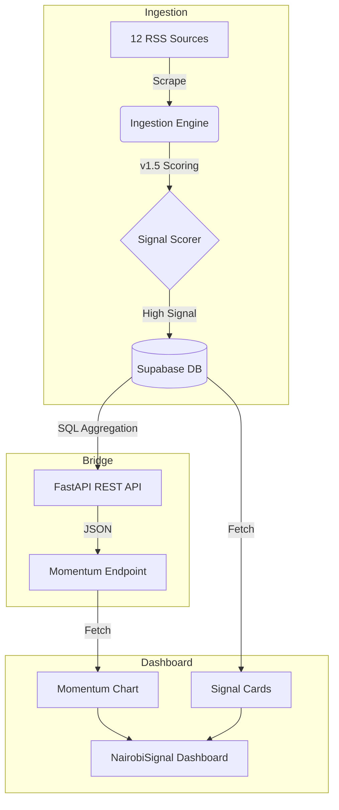

# 🇰🇪 NairobiSignal

**Live Economic Intelligence for the Kenyan Tech Ecosystem.**

NairobiSignal is a proprietary intelligence terminal that captures, scores, and visualizes the movement of capital and policy in Nairobi in real-time.

---

## 🏗️ System Architecture

The project follows a **Decoupled Data Pipeline** architecture, separating high-frequency ingestion from the presentation layer.


---

## 🛠️ Tech Stack

| Component | Technology |
|-----------|------------|
| Backend | Python 3.12, FastAPI, Uvicorn |
| Database | Supabase (PostgreSQL) |
| Frontend | Next.js 16 (App Router), TypeScript |
| Styling | Tailwind CSS v4 |
| Charts | Recharts |
| Scheduling | Crontab (4x daily) |
| Email | Resend API |

---

## 🚀 Quick Start

### 1. Clone the repository
```bash
git clone git@github.com:arapkirui513-hub/nairobi-signal.git
cd nairobi-signal
```

### 2. Set up environment variables
```bash
cp .env.example .env
```

Fill in your Supabase URL and key in the `.env` file.

### 3. Install Python dependencies
```bash
python3 -m venv venv
source venv/bin/activate
pip install -r requirements.txt
```

### 4. Start the backend engine
```bash
uvicorn api.main:app --reload --port 8000
```

### 5. Launch the dashboard

Open a second terminal:
```bash
cd frontend
npm install
npm run dev
```

### 6. Access the dashboard
```
http://localhost:3000
```

---

## 📊 Core Features

- **v1.5 Scoring Lens** — Filters noise to surface high-impact signals only
- **Weekly Momentum Chart** — Visualizes capital vs policy signal split by week
- **Real-time Feed** — 9 sources including TechCabal, Kenyan Wall Street, TechTrends KE
- **Automated Briefing** — Daily email digest of signals scoring above 5.0
- **Noise Suppression** — Hard zero scoring for gambling, gossip, and meme coins

---

## 📡 Signal Scoring

| Signal Type | Score | Example |
|-------------|-------|---------|
| Tectonic — $10M+ raise | +10.0 | Spiro raises $50M |
| Policy — CBK directive | +6.5 | CBK phone masking approval |
| Growth — expansion | +2.5 | M-PESA regional launch |
| Noise — gambling | -10.0 | Aviator winner story |

---

## 📈 Current Baseline

- **128 articles** scored as of March 2, 2026
- **550% surge** in capital signals week of Feb 23
- **94% noise suppression** rate
- **8 high-signal briefings** sent this cycle

---

## 🔒 Environment Variables
```bash
SUPABASE_URL=your_supabase_project_url
SUPABASE_KEY=your_supabase_anon_key
RESEND_API_KEY=your_resend_key
ENVIRONMENT=development
```

---

*Built for Kenya's investment and founder community.*
